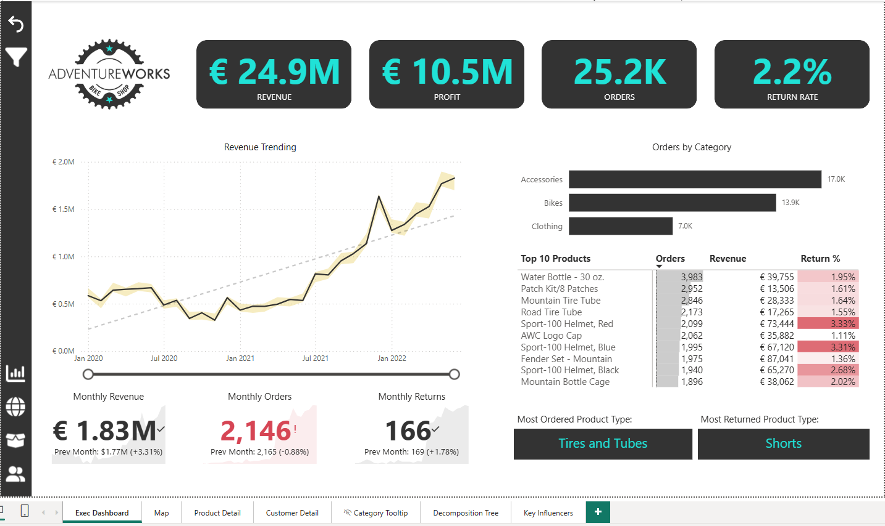
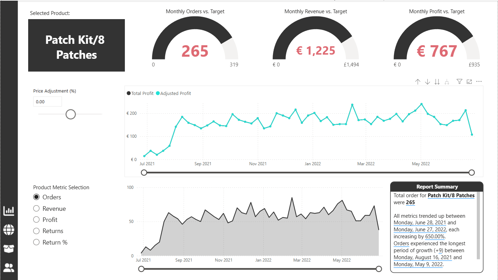
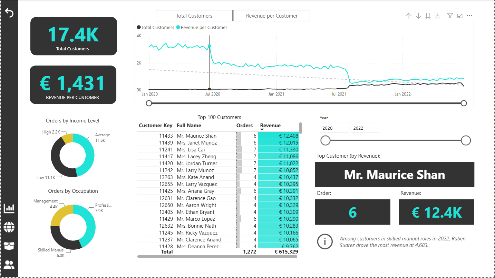

# powerbi-executive-sales-dashboard
Interactive Power BI dashboard for analysing revenue, profit, return rates, pricing scenarios, and product performance.
# Executive Sales Dashboard | Power BI

An interactive Power BI dashboard designed to help business stakeholders monitor sales performance, profitability, product returns, and pricing scenarios.

## Project Overview

This project transforms sales data into an executive-level reporting dashboard. It provides a central view of important business KPIs and allows users to investigate the factors influencing revenue and profitability.

The dashboard analyses:

- €24.9M in total revenue
- €10.5M in total profit
- Product return rates
- Sales performance across product categories
- The potential effect of pricing adjustments on profit margins

## Business Objective

The objective was to create an interactive reporting solution that enables decision-makers to:

- Monitor overall sales and profit performance
- Identify high- and low-performing product categories
- Analyse product return behaviour
- Investigate the root causes of sales results
- Simulate pricing changes and estimate their impact on profitability
- Move from high-level KPIs to detailed information

## Dashboard Features

### Executive KPI Overview

The main dashboard provides a consolidated view of revenue, profit, orders, returns, and product performance.

### What-If Pricing Analysis

A What-If parameter allows users to simulate price adjustments and immediately observe their potential impact on profit margins.

### Decomposition Tree

The Power BI Decomposition Tree enables root-cause analysis by breaking sales performance down across relevant product dimensions.

### Drill-Through Analysis

Users can move from summary visuals to more detailed product-level information using drill-through functionality.

### Interactive Navigation

The report includes:

- Filters and slicers
- Custom tooltips
- Bookmark-based navigation
- Drill-through pages
- Interactive charts and KPI cards

## Analytical Process

1. Imported and reviewed the sales data
2. Prepared the data for reporting
3. Created the required relationships and calculations
4. Defined business KPIs for revenue, profit, and returns
5. Built interactive dashboard visuals
6. Added What-If analysis and decomposition-tree functionality
7. Designed drill-through pages for detailed investigation
8. Refined the layout for clear executive reporting

## Key Insights Supported by the Dashboard

The dashboard helps users identify:

- Revenue and profit performance over time
- Product categories contributing most to sales
- Products associated with higher return rates
- Areas affecting profitability
- Potential financial effects of pricing changes

## Tools Used

- Microsoft Power BI Desktop
- Data modelling
- KPI development
- Interactive data visualisation
- What-If parameters
- Decomposition Tree
- Drill-through
- Bookmarks and tooltips

## Project Files

- [Download the Power BI report](./AdventureWorks%20Report.pbix)
- Dashboard screenshots are available in the [`screenshots`](./screenshots) folder

> The figures shown in this project represent the dataset used for portfolio analysis and are not presented as the financial results of a real employer or client.

## Author

**Bilal Ahmed Khanzada**

- [LinkedIn](https://www.linkedin.com/in/bilal-khanzada/)
- [GitHub](https://github.com/bilalahmed199717)
- Email: bilalahmed199717@gmail.com
